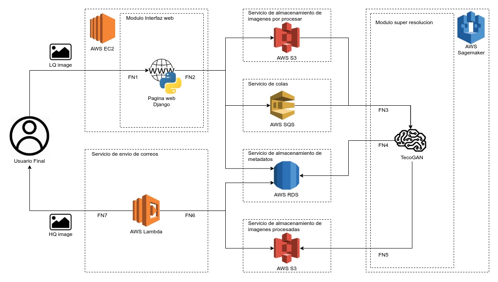

## Proyect IRSS architecture and explanation
##### Blocks diagram of this version of the system:

##### Flows that occur in this version of the system:
* FN1: First interaction between the system and the user, the user uploads an image with low resolution giving the system as additional data a email.
* FN2: The web interface takes the user's email and the image you want as input rebuild, the image is assigned a unique code with a 256-bit hash, however before assigning the code it is checked with the database that there are no images saved with that code, after checking that the code is not in use, write in the mail database to which the image is associated, its status is set as per process (1), the image is uploaded to s3 with its code and the image code is sent to a queue before being processed.
* FN3: The image code reaches the super resolution module and it is using the code Extract the image from the s3 where the images to be processed are stored and start the process of rebuild the image.
* FN4: At the end of the image reconstruction process the super resolution module changes the state of the image in the database from unprocessed (1) to processed (2).
* FN5: After writing the data to the database, the model sends the processed image even bucket on S3.
* FN6: A Lambda function is activated when saving the image in the image bucket As a result, the function searches the database for an image of the state step to process (1) has processed (2) and sends the image to the image destination mail.
* FN7: If the image is sent successfully, the status in the database passes processed (2) to delivered (3), otherwise it remains processed and in the following 4 uploads of data the image is forwarded, if after this delivery continues to fail the state goes to no deliver (4) and the image is not attempted again.
