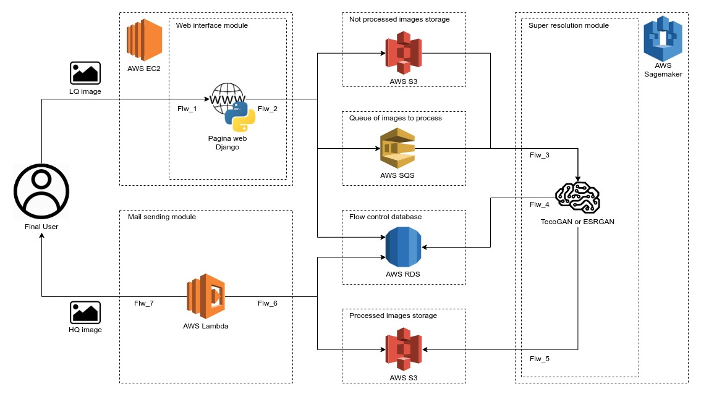

## Proyect IRSS architecture and explanation
The objective of the proyect IRSS (image resolution scaling service) is to develop an AWS-based service that using low-quality images can return the rescaled image as an output, improving its level of detail, for this the service will use implementations of AI-based super resolution technologies such as TecoGan or ESRGAN.
#### Blocks diagram for this version of the system:

#### Flows that occur in this version of the system:
* Flw_01: First interaction between the system and the user the user uploads an image with low resolution giving the system his email where the rebuilded image will be delivered in this step the page verify the users email.
* Flw_02: The web interface takes the user's email and the image that the user wants to rebuild as inputs the image is assigned a unique 256-bit hash however before assigning the code the system checks with the database that there are no images saved with that code after checking that the code is not in use the system write in the database the email to which the image is associated its status is set as not processed (1) the image is uploaded to s3 with its code as filename and the image code is sent to a queue before being processed.
* Flw_03: The image code in the queue reaches the super resolution module and this using the code takes the image from the s3 where the not processed images are stored and start the process of rebuild the image.
* Flw_04: At the end of the image reconstruction process the super resolution module changes the state of the image in the database from not processed (1) to processed (2).
* Flw_05: After writing the data to the database, the super resolution module sends the processed image to a bucket onS3 where the processed images are saved.
* Flw_06: A Lambda function is activated when the super resolution module saves the image in the processed image bucket while active the function searches in the database a image that recently had pass from the state of not process (1) to processed (2) and saves it in the lambda temporal file system.
* Flw_07: If the image is sent successfully, the status in the database passes from processed (2) to delivered (3) and the image saved in the lambda temporal file system is erased from it otherwise the status in the database passes to not delivered (4) and the image is erased from the lambda temporal file system.
